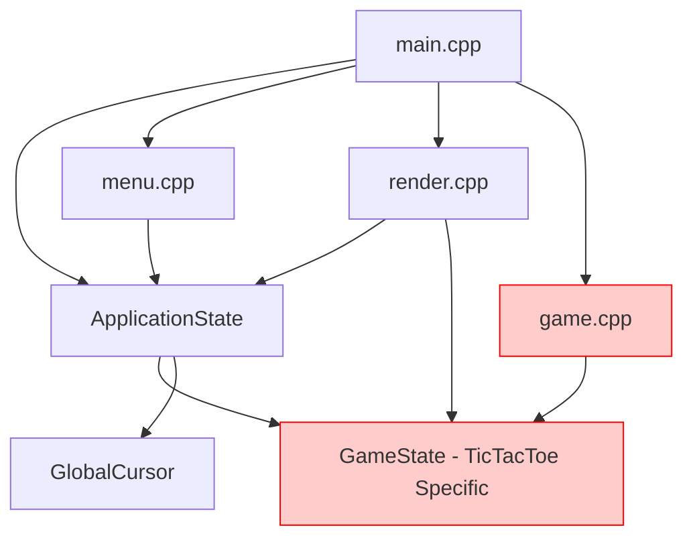
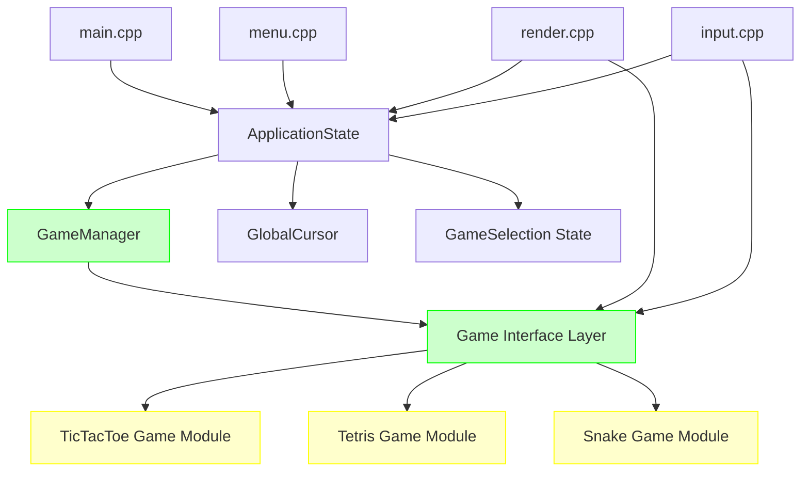
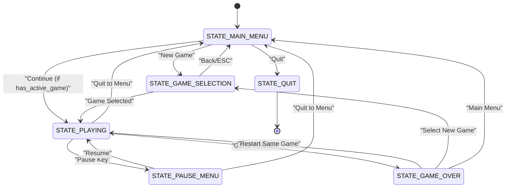

# Backend Architecture Refactoring: Multi-Game Support

## Overview

This document outlines the architectural refactoring needed to transform the current single-game Tic-Tac-Toe application into a flexible multi-game platform that can support different games like Tetris and Snake while maintaining the functional programming paradigm and existing terminal-based UI framework.

## Current Architecture Analysis

The existing system follows a functional state-driven architecture with the following characteristics:

- **Monolithic Game Logic**: All game-specific logic is hardcoded in `game.cpp/game.h`
- **Direct State Coupling**: Application state directly contains `GameState` structure specific to Tic-Tac-Toe
- **Game-Specific Rendering**: Rendering functions are tightly coupled to Tic-Tac-Toe board representation
- **Fixed Input Handling**: Input processing assumes Tic-Tac-Toe specific actions and coordinates

### Current Component Dependencies



## Target Architecture: Game Engine Pattern

### Core Design Principles

1. **Game Abstraction**: Define a common interface that all games must implement
2. **Plugin-Style Games**: Each game is a self-contained module with its own state and logic
3. **Unified Application State**: Maintain a game-agnostic application state structure
4. **Generic Input/Render Pipeline**: Create flexible input and rendering systems that work with any game
5. **Functional Paradigm Preservation**: Continue using functional programming without classes

### Proposed Architecture Overview



## Detailed Architecture Design

### 1. Game Interface Definition

Define a common interface that all games must implement through function pointers and standardized data structures:

```c
// Core game interface structure
typedef struct GameInterface {
    // Game identification
    const char* game_name;
    const char* game_description;
    
    // Core game lifecycle functions
    void (*init_game)(void* game_state);
    void (*reset_game)(void* game_state);
    void (*update_game)(void* game_state, double delta_time);
    bool (*is_game_active)(const void* game_state);
    bool (*is_game_over)(const void* game_state);
    
    // Input handling
    bool (*handle_input)(void* game_state, const struct tb_event* event, 
                        const GlobalCursor* cursor);
    bool (*handle_cursor_click)(void* game_state, int x, int y);
    
    // Rendering
    void (*render_game)(const void* game_state, int screen_width, int screen_height);
    void (*render_game_ui)(const void* game_state);
    
    // Hover detection for cursor system
    bool (*update_hover_state)(void* game_state, const GlobalCursor* cursor);
    
    // Game state queries
    bool (*has_winner)(const void* game_state);
    bool (*is_draw)(const void* game_state);
    const char* (*get_status_text)(const void* game_state);
    
    // Memory management
    size_t game_state_size;
    void (*cleanup_game)(void* game_state);
} GameInterface;
```

### 2. Game Manager System

Central component that manages game selection, instantiation, and lifecycle:

```c
typedef enum {
    GAME_TYPE_TICTACTOE,
    GAME_TYPE_TETRIS,
    GAME_TYPE_SNAKE,
    GAME_TYPE_COUNT
} GameType;

typedef struct {
    GameType current_game_type;
    const GameInterface* current_game_interface;
    void* current_game_state;
    bool game_loaded;
    bool game_initialized;
} GameManager;

// Game manager functions
void init_game_manager(GameManager* manager);
bool load_game(GameManager* manager, GameType game_type);
void unload_current_game(GameManager* manager);
const GameInterface* get_game_interface(GameType game_type);
void cleanup_game_manager(GameManager* manager);
```

### 3. Refactored Application State

```c
typedef enum {
    STATE_MAIN_MENU,
    STATE_GAME_SELECTION,
    STATE_PLAYING,
    STATE_GAME_OVER,
    STATE_PAUSE_MENU,
    STATE_QUIT
} AppState;

typedef struct {
    AppState current_state;
    AppState previous_state;  // For returning from pause/options
    
    // Game management
    GameManager game_manager;
    
    // UI state
    int menu_selection;
    int game_selection;  // Which game is selected in game selection menu
    bool has_active_game;
    
    // Global cursor system (unchanged)
    GlobalCursor cursor;
    
    // Timing for games that need it
    double last_update_time;
    double frame_delta;
} ApplicationState;
```

### 4. Game-Specific Modules

Each game implements the `GameInterface` and manages its own state:

#### TicTacToe Game Module (`games/tictactoe.c`)

```c
// TicTacToe specific state (moved from global GameState)
typedef struct {
    CellState board[3][3];
    CellState current_player;
    bool game_active;
    CellState winner;
    bool is_draw;
    
    // UI state specific to TicTacToe
    int hovered_cell_x;
    int hovered_cell_y;
} TicTacToeState;

// Implementation functions
void tictactoe_init(void* state);
void tictactoe_reset(void* state);
bool tictactoe_handle_input(void* state, const struct tb_event* event, 
                           const GlobalCursor* cursor);
void tictactoe_render(const void* state, int screen_width, int screen_height);
// ... other interface implementations

// Game interface registration
const GameInterface* get_tictactoe_interface(void);
```

#### Tetris Game Module (`games/tetris.c`)

```c
typedef struct {
    int board[20][10];  // Standard Tetris board
    int current_piece[4][4];
    int current_piece_x;
    int current_piece_y;
    int current_piece_type;
    int next_piece_type;
    int score;
    int level;
    int lines_cleared;
    bool game_active;
    double last_drop_time;
    double drop_interval;
} TetrisState;

// Interface implementation
const GameInterface* get_tetris_interface(void);
```

#### Snake Game Module (`games/snake.c`)

```c
typedef struct {
    int snake_x[100];
    int snake_y[100];
    int snake_length;
    int food_x;
    int food_y;
    int direction;
    int score;
    bool game_active;
    double last_move_time;
    double move_interval;
} SnakeState;

// Interface implementation  
const GameInterface* get_snake_interface(void);
```

### 5. Generic Input/Render Pipeline

#### Input Handling (`input.c`)

```c
void handle_application_input(ApplicationState* app, const struct tb_event* event) {
    switch (app->current_state) {
        case STATE_MAIN_MENU:
            handle_main_menu_input(app, event);
            break;
            
        case STATE_GAME_SELECTION:
            handle_game_selection_input(app, event);
            break;
            
        case STATE_PLAYING:
            // Delegate to current game
            if (app->game_manager.current_game_interface) {
                bool handled = app->game_manager.current_game_interface->handle_input(
                    app->game_manager.current_game_state, event, &app->cursor);
                
                if (!handled) {
                    // Handle universal game keys (pause, quit, etc.)
                    handle_universal_game_input(app, event);
                }
            }
            break;
            
        case STATE_GAME_OVER:
            handle_game_over_input(app, event);
            break;
            
        case STATE_PAUSE_MENU:
            handle_pause_menu_input(app, event);
            break;
    }
}
```

#### Rendering System (`render.c`)

```c
void render_application(const ApplicationState* app) {
    clear_screen();
    
    switch (app->current_state) {
        case STATE_MAIN_MENU:
            render_main_menu(app);
            break;
            
        case STATE_GAME_SELECTION:
            render_game_selection_menu(app);
            break;
            
        case STATE_PLAYING:
            if (app->game_manager.current_game_interface) {
                // Render game-specific content
                app->game_manager.current_game_interface->render_game(
                    app->game_manager.current_game_state, 
                    tb_width(), tb_height());
                
                // Render universal game UI elements
                render_universal_game_ui(app);
            }
            break;
            
        case STATE_GAME_OVER:
            // Render game and overlay game over screen
            if (app->game_manager.current_game_interface) {
                app->game_manager.current_game_interface->render_game(
                    app->game_manager.current_game_state,
                    tb_width(), tb_height());
            }
            render_game_over_overlay(app);
            break;
            
        case STATE_PAUSE_MENU:
            // Render game in background and pause overlay
            if (app->game_manager.current_game_interface) {
                app->game_manager.current_game_interface->render_game(
                    app->game_manager.current_game_state,
                    tb_width(), tb_height());
            }
            render_pause_overlay(app);
            break;
    }
    
    // Always render global cursor on top
    render_global_cursor(app);
    present_screen();
}
```

### 6. Menu System Enhancement

Enhanced menu system to support game selection:

```c
typedef enum {
    MENU_MAIN,
    MENU_GAME_SELECTION,
    MENU_PAUSE,
    MENU_GAME_OVER
} MenuType;

typedef struct {
    const char* text;
    bool enabled;
    void (*action)(ApplicationState* app);
} MenuItem;

void render_game_selection_menu(const ApplicationState* app) {
    int center_x = tb_width() / 2;
    int start_y = 8;
    
    render_text_centered("Select Game", center_x, start_y - 2, TB_WHITE, TB_BLACK);
    
    // Render available games
    for (int i = 0; i < GAME_TYPE_COUNT; i++) {
        const GameInterface* game_interface = get_game_interface(i);
        if (game_interface) {
            uint32_t fg = (app->game_selection == i && app->cursor.hovered_menu_item == i) 
                         ? TB_BLACK : TB_WHITE;
            uint32_t bg = (app->game_selection == i && app->cursor.hovered_menu_item == i) 
                         ? TB_CYAN : TB_BLACK;
            
            render_text_centered(game_interface->game_name, center_x, start_y + i, fg, bg);
        }
    }
    
    render_text_centered("Press Enter to select, ESC to go back", 
                        center_x, start_y + GAME_TYPE_COUNT + 2, TB_WHITE, TB_BLACK);
}
```

## State Transitions



## File Organization

```
src/
├── main.cpp                 # Application entry point and main loop
├── application.h/.c         # ApplicationState and core application logic
├── game_manager.h/.c        # Game management system
├── input.h/.c               # Generic input handling
├── render.h/.c              # Generic rendering system
├── menu.h/.c                # Enhanced menu system
├── cursor.h/.c              # Global cursor system (extracted)
└── games/                   # Game-specific modules
    ├── game_interface.h     # Game interface definition
    ├── tictactoe.h/.c       # TicTacToe game implementation
    ├── tetris.h/.c          # Tetris game implementation (future)
    └── snake.h/.c           # Snake game implementation (future)
```

## Migration Strategy

### Phase 1: Extract Game Interface
1. Create `games/game_interface.h` with interface definition
2. Create `game_manager.h/.c` with game management logic
3. Refactor `ApplicationState` to use `GameManager`

### Phase 2: Modularize TicTacToe
1. Move TicTacToe logic to `games/tictactoe.c`
2. Implement `GameInterface` for TicTacToe
3. Update main loop to use game manager

### Phase 3: Generic Input/Render
1. Extract generic input handling from `menu.cpp`
2. Create generic rendering pipeline in `render.cpp`
3. Implement game selection menu

### Phase 4: Add New Games
1. Implement Tetris game module
2. Implement Snake game module  
3. Register new games in game manager

## Testing Strategy

### Unit Testing
- Test each game module independently
- Test game manager game switching
- Test input routing to correct game
- Test state transitions

### Integration Testing  
- Test complete game lifecycle for each game
- Test switching between games
- Test pause/resume functionality
- Test cursor system across different games

## Benefits of This Architecture

1. **Extensibility**: Adding new games requires only implementing the interface
2. **Maintainability**: Each game is self-contained with clear boundaries  
3. **Reusability**: Common systems (input, rendering, cursor) work across all games
4. **Functional Paradigm**: Maintains functional programming style throughout
5. **Performance**: No overhead from virtual function calls or complex inheritance
6. **Memory Efficiency**: Only active game state is loaded in memory

## Future Enhancements

1. **Game Save/Load System**: Extend interface to support game state persistence
2. **Multiplayer Support**: Add network interface to game system
3. **Plugin Architecture**: Load games dynamically from shared libraries
4. **Configuration System**: Game-specific settings and controls
5. **Achievement System**: Cross-game achievement tracking
6. **Theme System**: Customizable visual themes for different games