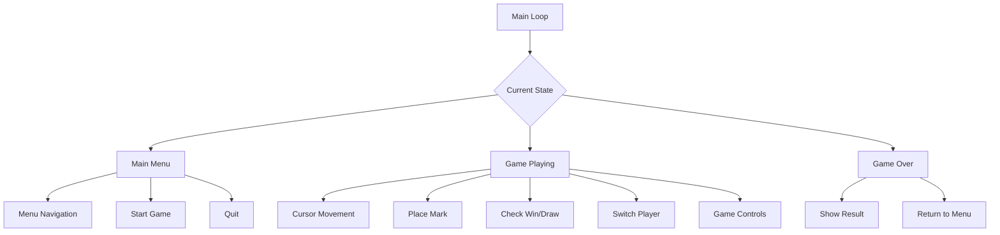
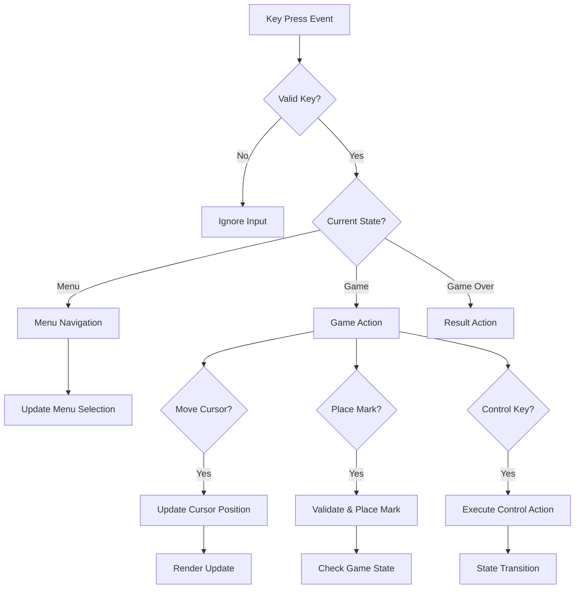
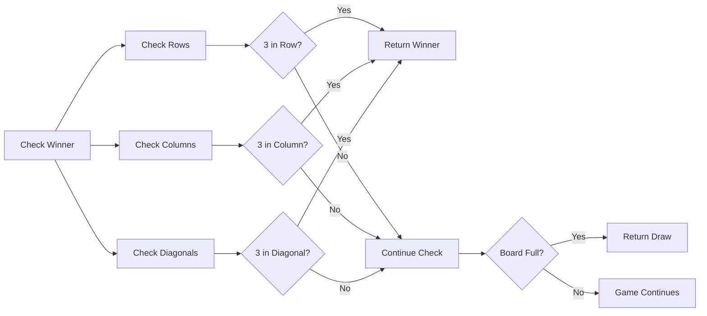
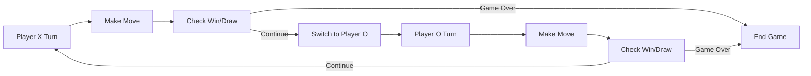
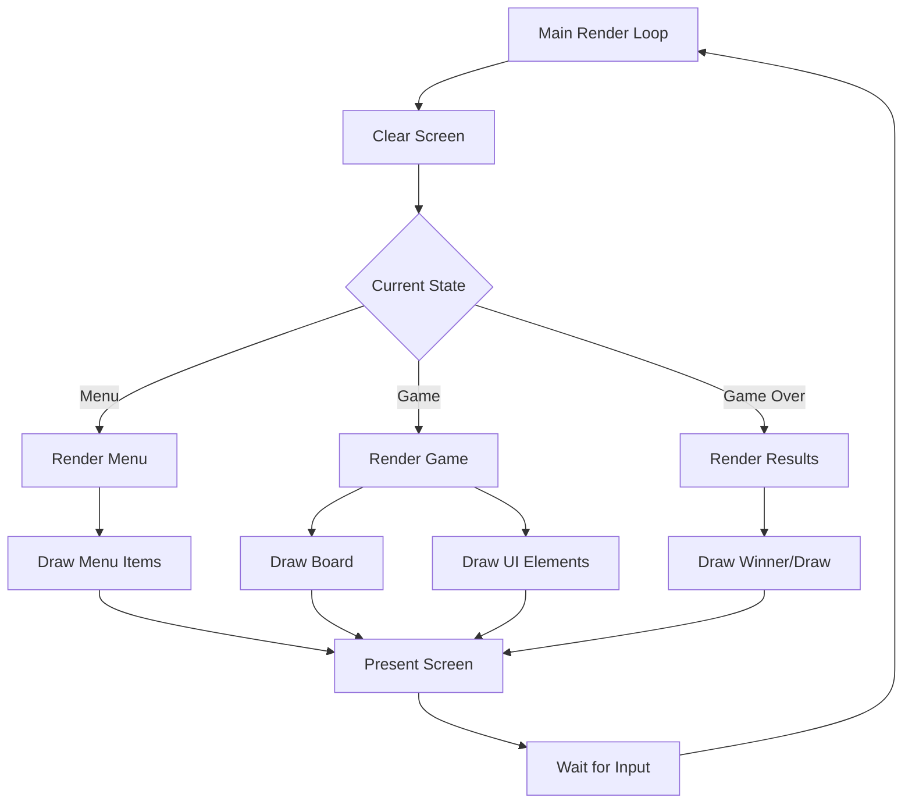

# Tic-Tac-Toe Console Game Design

## Overview

This design document outlines the implementation of a console-based tic-tac-toe game written in C++ using the termbox2 library for terminal I/O. The game features cursor-based navigation, interactive gameplay, and a functional programming approach without classes.

## Technology Stack & Dependencies

- **Language**: C++
- **Terminal I/O Library**: termbox2 (git submodule in `lib/termbox2/`)
- **Programming Paradigm**: Functional programming (no classes)
- **Build System**: Makefile

### Termbox2 Integration
- **Location**: `lib/termbox2/termbox2.h` (git submodule)
- **Implementation**: Single header library (`#define TB_IMPL`)
- **Include Path**: `#include "lib/termbox2/termbox2.h"`
- **Build Configuration**: Link against termbox2 from submodule

### Core Termbox2 Functions
- `tb_init()` / `tb_shutdown()` - Terminal initialization and cleanup
- `tb_set_cell()` - Draw individual characters at specific positions
- `tb_printf()` - Formatted text output
- `tb_poll_event()` / `tb_peek_event()` - Input event handling
- `tb_present()` - Commit changes to screen buffer
- `tb_clear()` - Clear the screen buffer
- `tb_width()` / `tb_height()` - Get terminal dimensions
- `tb_set_cursor()` / `tb_hide_cursor()` - Cursor management

## Architecture

### Game State Management



### Data Structures

#### Game Board Representation
```
typedef enum {
    CELL_EMPTY = 0,
    CELL_X = 1,
    CELL_O = 2
} CellState;

typedef struct {
    CellState board[3][3];
    int cursor_x;
    int cursor_y;
    CellState current_player;
    bool game_active;
} GameState;
```

#### Application State
```
typedef enum {
    STATE_MAIN_MENU,
    STATE_PLAYING,
    STATE_GAME_OVER,
    STATE_QUIT
} AppState;

typedef struct {
    AppState current_state;
    GameState game;
    int menu_selection;
    CellState winner;
    bool is_draw;
} ApplicationState;
```

### Function Architecture

#### Core Game Functions

| Function | Purpose | Parameters | Return |
|----------|---------|------------|--------|
| `init_game()` | Initialize game state | `GameState*` | `void` |
| `reset_board()` | Clear game board | `GameState*` | `void` |
| `is_valid_move()` | Check if move is legal | `GameState*`, `int x`, `int y` | `bool` |
| `make_move()` | Place mark on board | `GameState*`, `int x`, `int y` | `bool` |
| `check_winner()` | Determine game outcome | `GameState*` | `CellState` |
| `is_board_full()` | Check for draw condition | `GameState*` | `bool` |
| `switch_player()` | Toggle current player | `GameState*` | `void` |

#### Rendering Functions

| Function | Purpose | Parameters | Return |
|----------|---------|------------|--------|
| `render_main_menu()` | Draw main menu screen | `ApplicationState*` | `void` |
| `render_game_board()` | Draw game board | `GameState*` | `void` |
| `render_game_ui()` | Draw game interface | `GameState*` | `void` |
| `render_game_over()` | Draw game result | `ApplicationState*` | `void` |
| `render_cursor()` | Highlight current position | `int x`, `int y` | `void` |
| `render_controls()` | Show control hints | `AppState` | `void` |

#### Input Handling Functions

| Function | Purpose | Parameters | Return |
|----------|---------|------------|--------|
| `handle_menu_input()` | Process main menu input | `ApplicationState*`, `tb_event*` | `void` |
| `handle_game_input()` | Process gameplay input | `ApplicationState*`, `tb_event*` | `void` |
| `move_cursor()` | Update cursor position | `GameState*`, `int dx`, `int dy` | `void` |

## User Interface Design

### Main Menu Layout

```
        TIC-TAC-TOE GAME
        ================
        
     > [N] New Game
       [C] Continue (if game in progress)
       [Q] Quit
       
    Controls:
    ↑↓ or W/S - Navigate
    Enter - Select
```

### Game Board Layout

```
    Current Player: X
    
    ┌───┬───┬───┐
    │ X │   │ O │
    ├───┼───┼───┤
    │   │[X]│   │    <- Cursor position
    ├───┼───┼───┤
    │ O │   │ X │
    └───┴───┴───┘
    
    Controls:
    ↑↓←→ or WASD - Move cursor
    Enter - Place mark
    [R] Restart  [M] Main Menu  [Q] Quit
```

### Game Over Screen

```
        GAME OVER
        =========
        
      Player X Wins!
      
    [R] Restart Game
    [M] Main Menu
    [Q] Quit
```

## Input Controls System

### Key Mapping

| Key | Action | Context |
|-----|--------|---------|
| `↑` / `W` | Move Up / Menu Up | Game / Menu |
| `↓` / `S` | Move Down / Menu Down | Game / Menu |
| `←` / `A` | Move Left | Game |
| `→` / `D` | Move Right | Game |
| `Enter` | Select / Place Mark | Menu / Game |
| `R` | Restart Game | Game / Game Over |
| `M` | Main Menu | Game / Game Over |
| `N` | New Game | Menu |
| `C` | Continue Game | Menu |
| `Q` | Quit | All States |

### Input Validation Flow



## Game Logic Implementation

### Win Condition Check



### Move Validation Rules

1. **Position Bounds**: Cursor must be within 3x3 grid
2. **Cell Availability**: Target cell must be empty
3. **Game Active**: Game must not be over
4. **Valid Player**: Current player must be set

### Player Turn Management



## Menu System

### Main Menu States

| State | Description | Available Actions |
|-------|-------------|-------------------|
| **No Active Game** | Initial state or after game completion | New Game, Quit |
| **Game In Progress** | Game paused/minimized | Continue, New Game, Quit |

### Menu Navigation

- **Vertical Navigation**: Arrow keys or W/S
- **Selection Highlighting**: Visual cursor indicator
- **Action Execution**: Enter key confirmation

## Screen Rendering System

### Rendering Pipeline



### Visual Elements

#### Board Symbols
- **Empty Cell**: Space or dot
- **Player X**: 'X' character
- **Player O**: 'O' character
- **Cursor**: Highlighted cell border or background

#### Color Scheme
- **Default Text**: White on black
- **Cursor Highlight**: Inverted colors
- **Player X**: Red or bright color
- **Player O**: Blue or contrasting color
- **UI Elements**: Gray or muted colors

## Error Handling

### Project Structure
```
tictactoe/
├── src/
│   ├── main.cpp
│   ├── game.cpp
│   ├── game.h
│   ├── menu.cpp
│   ├── menu.h
│   ├── render.cpp
│   └── render.h
├── lib/
│   └── termbox2/          # Git submodule
│       ├── termbox2.h
│       ├── demo/
│       └── ...
├── Makefile
└── README.md
```

### Build Configuration

#### Makefile Setup
```makefile
CXX = g++
CXXFLAGS = -Wall -Wextra -std=c++17 -Ilib
SRCDIR = src
OBJDIR = obj
SOURCES = $(wildcard $(SRCDIR)/*.cpp)
OBJECTS = $(SOURCES:$(SRCDIR)/%.cpp=$(OBJDIR)/%.o)
TARGET = tictactoe

$(TARGET): $(OBJECTS)
	$(CXX) $(OBJECTS) -o $@

$(OBJDIR)/%.o: $(SRCDIR)/%.cpp | $(OBJDIR)
	$(CXX) $(CXXFLAGS) -c $< -o $@

$(OBJDIR):
	mkdir -p $(OBJDIR)

clean:
	rm -rf $(OBJDIR) $(TARGET)

.PHONY: clean
```

#### Header Include
```cpp
#define TB_IMPL
#include "lib/termbox2/termbox2.h"
```

### Terminal Initialization
```cpp
if (tb_init() != 0) {
    fprintf(stderr, "Failed to initialize termbox\n");
    return 1;
}
```

### Input Event Errors
- Invalid key codes handling
- Event polling timeouts
- Terminal resize events

### Game State Validation
- Invalid cursor positions
- Illegal move attempts
- State transition errors

## Performance Considerations

### Rendering Optimization
- **Selective Updates**: Only redraw changed areas
- **Double Buffering**: Use termbox2's present() system
- **Minimal Redraws**: Track dirty screen regions

### Memory Management
- **Stack Allocation**: Use local variables for game state
- **Static Buffers**: Fixed-size arrays for board representation
- **No Dynamic Allocation**: Avoid malloc/new usage

## Testing Strategy

### Manual Testing Scenarios

1. **Menu Navigation**
   - Navigate through all menu options
   - Test keyboard shortcuts
   - Verify state transitions

2. **Gameplay Testing**
   - Complete games with all outcomes (X wins, O wins, draw)
   - Test cursor movement boundaries
   - Verify illegal move rejection

3. **Control Testing**
   - Test all keyboard shortcuts
   - Verify restart functionality
   - Test quit scenarios

4. **Edge Cases**
   - Terminal resize during gameplay
   - Rapid key presses
   - Invalid input sequences

### Unit Testing Approach

```
Function: check_winner()
- Test all winning combinations (8 total)
- Test non-winning board states
- Test empty board
- Test partial games

Function: is_valid_move()
- Test boundary conditions
- Test occupied cell attempts
- Test valid moves

Function: move_cursor()
- Test boundary wrapping/clamping
- Test all directions
- Test from all positions
```