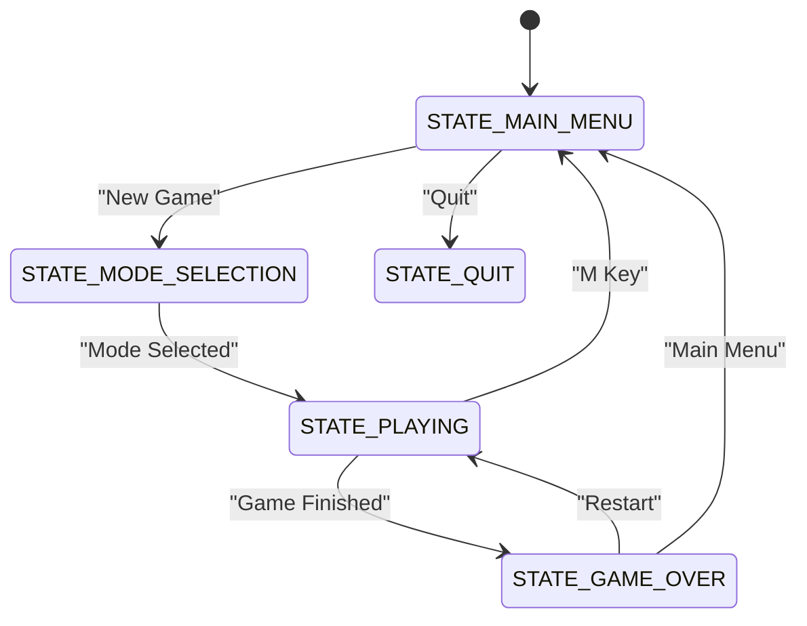
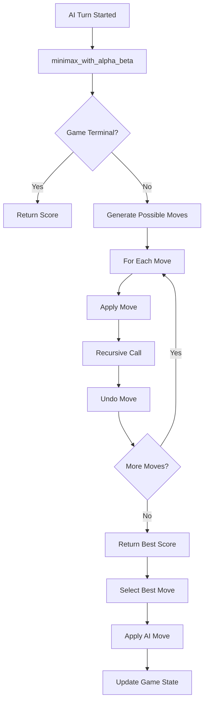
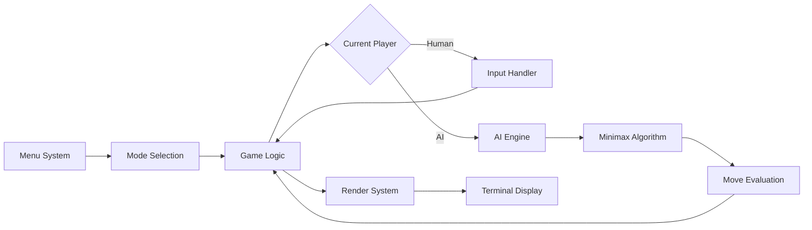
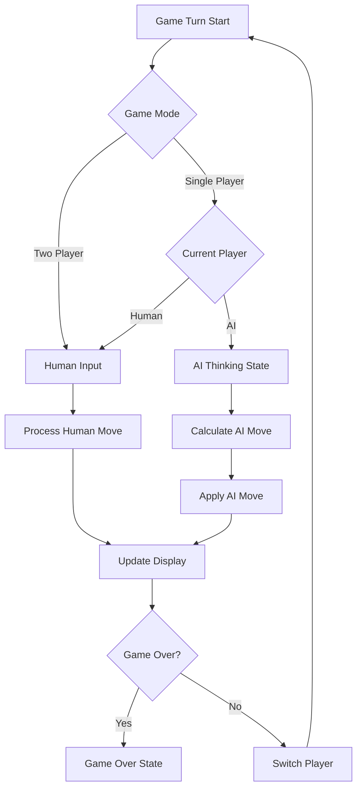

# Single-Player AI Opponent Feature Design

## Overview

This design document outlines the implementation of AI opponent functionality for the terminal-based tic-tac-toe game. The feature will extend the existing two-player system to support single-player mode where a human player competes against an AI opponent using the minimax algorithm with strategic enhancements.

## Technology Stack & Dependencies

- **Core Language**: C++17 (functional programming style)
- **UI Library**: termbox2 (terminal interface)
- **Build System**: Make
- **AI Algorithm**: Minimax with alpha-beta pruning
- **Additional Structures**: AI difficulty settings, game mode selection

## Architecture

### Game Mode Management

The application will extend the existing state machine to support game mode selection and AI integration:



### Enhanced Data Structures

#### Game Mode Enumeration
```c
typedef enum {
    MODE_TWO_PLAYER,
    MODE_SINGLE_PLAYER
} GameMode;

typedef enum {
    DIFFICULTY_EASY,
    DIFFICULTY_MEDIUM,
    DIFFICULTY_HARD
} AIDifficulty;
```

#### Extended Application State
```c
typedef struct {
    AppState current_state;
    GameState game;
    GameMode game_mode;
    AIDifficulty ai_difficulty;
    CellState human_player;    // CELL_X or CELL_O
    CellState ai_player;       // CELL_X or CELL_O
    bool ai_thinking;          // Visual feedback during AI turn
    int menu_selection;
    int mode_selection;
    int difficulty_selection;
    CellState winner;
    bool is_draw;
    bool has_active_game;
    GlobalCursor cursor;
} ApplicationState;
```

### AI Algorithm Architecture

#### Minimax Implementation


#### Scoring Strategy
- **Win for AI**: +10 points
- **Win for Human**: -10 points  
- **Draw**: 0 points
- **Depth Penalty**: Subtract depth to prefer immediate wins
- **Difficulty Adjustments**: Introduce strategic errors for easier levels

### Component Interaction



## Feature Implementation

### Mode Selection Interface

#### Main Menu Enhancement
- **New Game** → Navigate to Mode Selection
- **Continue** → Resume existing game (mode preserved)
- **Settings** → AI difficulty configuration
- **Quit** → Exit application

#### Mode Selection Screen
- **Two Player** → Traditional human vs human
- **Single Player** → Human vs AI
- **Back** → Return to main menu

#### Difficulty Selection (Single Player)
- **Easy** → AI makes occasional suboptimal moves
- **Medium** → AI uses basic minimax
- **Hard** → AI with alpha-beta pruning (unbeatable)

### AI Engine Functions

#### Core AI Functions
```c
// Main AI decision function
int get_ai_move(const GameState* game, CellState ai_player, AIDifficulty difficulty);

// Minimax algorithm with alpha-beta pruning
int minimax_alpha_beta(GameState* game, int depth, int alpha, int beta, 
                      bool maximizing, CellState ai_player, CellState human_player);

// Game state evaluation
int evaluate_game_state(const GameState* game, CellState ai_player, CellState human_player);

// Difficulty-based move selection
int apply_difficulty_filter(int best_move, int* move_scores, int move_count, AIDifficulty difficulty);

// Move generation and validation
void get_available_moves(const GameState* game, int* moves, int* move_count);
bool simulate_move(GameState* game, int x, int y, CellState player);
void undo_move(GameState* game, int x, int y);
```

#### Strategic Enhancements
```c
// Strategic position evaluation
int evaluate_strategic_positions(const GameState* game, CellState player);

// Opening book for early game
int get_opening_move(const GameState* game, CellState ai_player);

// Center and corner preference
int apply_positional_bonus(int x, int y);
```

### Game Flow Integration

#### Turn Management


#### AI Thinking Visualization
- Display "AI is thinking..." message
- Show animated dots or spinner
- Brief delay for user experience (even if AI is instant)
- Highlight AI's chosen move with different color

### Input Handling Enhancement

#### Extended Menu Input Handler
```c
void handle_mode_selection_input(ApplicationState* app, const struct tb_event* event);
void handle_difficulty_selection_input(ApplicationState* app, const struct tb_event* event);
```

#### Game Input Modification
```c
void handle_game_input_with_ai(ApplicationState* app, const struct tb_event* event) {
    // Handle human input normally
    if (app->game_mode == MODE_SINGLE_PLAYER && 
        app->game.current_player == app->ai_player) {
        // Skip input processing during AI turn
        return;
    }
    
    // Process normal game input
    handle_game_input(app, event);
    
    // Trigger AI move if it's AI's turn
    if (app->game_mode == MODE_SINGLE_PLAYER && 
        app->game.current_player == app->ai_player && 
        app->game.game_active) {
        trigger_ai_move(app);
    }
}
```

### Rendering System Updates

#### Mode Selection Screen
```c
void render_mode_selection(const ApplicationState* app);
void render_difficulty_selection(const ApplicationState* app);
```

#### Enhanced Game Display
```c
void render_game_with_ai_info(const ApplicationState* app) {
    render_game_board(app);
    
    if (app->game_mode == MODE_SINGLE_PLAYER) {
        render_player_indicators(app);
        
        if (app->ai_thinking) {
            render_ai_thinking_animation(app);
        }
        
        if (app->game.current_player == app->ai_player) {
            render_ai_turn_indicator(app);
        }
    }
    
    render_game_controls(app);
}
```

### Difficulty Implementation

#### Easy Difficulty
- 70% optimal moves, 30% random valid moves
- Intentionally miss some winning opportunities
- Simple evaluation function

#### Medium Difficulty  
- 90% optimal moves, 10% good but suboptimal moves
- Basic minimax without full depth search
- Limited look-ahead (depth 3-4)

#### Hard Difficulty
- 100% optimal moves using full minimax
- Alpha-beta pruning for efficiency
- Full depth search (8-9 moves ahead)
- Strategic opening and endgame play

### State Management Enhancement

#### Game State Persistence
- Preserve game mode across state transitions
- Maintain AI difficulty settings
- Handle game resumption with correct mode

#### AI State Tracking
```c
typedef struct {
    bool ai_move_in_progress;
    int ai_last_move_x;
    int ai_last_move_y;
    double ai_thinking_start_time;
    int ai_evaluation_calls;
} AIState;
```

## Testing Strategy

### Unit Testing
- AI move generation validation
- Minimax algorithm correctness
- Difficulty level behavior verification
- Edge case handling (full board, winning positions)

### Integration Testing
- Mode selection flow
- Human-AI turn alternation
- State transitions with AI components
- Input handling during AI turns

### Performance Testing
- AI response time measurement
- Memory usage during minimax calculations
- Terminal rendering performance with AI animations

### User Experience Testing
- AI difficulty perception validation
- Visual feedback effectiveness
- Menu navigation intuitiveness
- Game flow smoothness

## Implementation Phases

### Phase 1: Core AI Infrastructure
1. Extend data structures for game modes
2. Implement basic minimax algorithm
3. Add AI move generation functions
4. Create difficulty selection mechanism

### Phase 2: User Interface Integration
1. Design mode selection screen
2. Implement difficulty selection interface
3. Add AI turn indicators
4. Create thinking animation system

### Phase 3: Game Flow Integration
1. Modify input handling for AI turns
2. Integrate AI into game loop
3. Update state transitions
4. Add AI move highlighting

### Phase 4: Polish and Optimization
1. Implement strategic enhancements
2. Add visual improvements
3. Performance optimization
4. Comprehensive testing

## Performance Considerations

### Minimax Optimization
- Alpha-beta pruning reduces search space by ~50%
- Depth limitation prevents excessive computation
- Move ordering improves pruning effectiveness
- Transposition table for repeated position caching

### Memory Management
- Stateless AI functions minimize memory usage
- Board copying for simulation kept minimal
- No dynamic memory allocation required
- Stack-based recursion with depth limits

### User Experience
- AI thinking delay prevents instant moves
- Progressive disclosure in difficulty selection
- Clear visual feedback for all AI actions
- Responsive controls even during AI computation